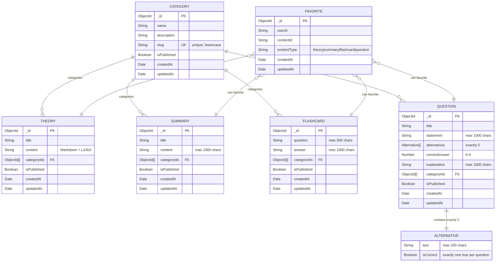

# Database Schema - Math Learn Platform

## 📊 Diagrama de Entidades e Relacionamentos



## 🎯 Regras de Negócio Implementadas

### Categories
- ✅ Nome único e obrigatório (max 100 chars)
- ✅ Slug único, lowercase, apenas letras/números/hífens
- ✅ Sistema de publicação (draft/published)
- ✅ Métodos: findPublished(), publish(), unpublish()

### Theory
- ✅ Conteúdo em Markdown + LaTeX
- ✅ Múltiplas categorias (array de IDs)
- ✅ Sistema de publicação
- ✅ Busca full-text em título e conteúdo

### Questions
- ✅ **Exatamente 5 alternativas** (RN6)
- ✅ **Exatamente 1 alternativa correta** por questão
- ✅ Index correctAnswer deve corresponder à alternativa correta
- ✅ Explicação obrigatória para todas as questões

### Summary
- ✅ Conteúdo limitado a 1000 caracteres
- ✅ Texto direto e conciso
- ✅ Múltiplas categorias

### Flashcard
- ✅ Pergunta (max 500 chars) e resposta (max 1000 chars)
- ✅ Múltiplas categorias
- ✅ Sistema de publicação

### Favorites
- ✅ Relacionamento polimórfico com todos os tipos de conteúdo
- ✅ Prevenção de duplicatas (unique index)
- ✅ Validação de existência do conteúdo
- ✅ Métodos: toggleFavorite(), isFavorited(), findUserFavorites()

## 📚 Índices Implementados

### Performance Indexes
```javascript
// Categories
{ slug: 1 } // unique
{ isPublished: 1 }
{ createdAt: -1 }

// Theory, Summary, Flashcard, Question
{ categoryIds: 1 }
{ isPublished: 1 }
{ createdAt: -1 }
{ title: "text", content: "text" } // full-text search

// Questions específico
{ title: "text", statement: "text" }

// Favorites
{ userId: 1, contentId: 1, contentType: 1 } // unique compound
{ userId: 1, contentType: 1 }
{ userId: 1, createdAt: -1 }
```

## 🚀 Estratégia de Implementação Admin CRUD

### Fase 1: Estrutura Base Admin
1. **Layout Admin** - Sistema de navegação consistente
2. **Componentes Base** - Forms, Tables, Modals reutilizáveis
3. **API Routes** - CRUD completo para todas as entidades
4. **Validação** - Client-side e server-side

### Fase 2: CRUD por Entidade
1. **Categories** ✅ (já implementado)
2. **Theory** - Editor Markdown + LaTeX preview
3. **Questions** - Form complexo com 5 alternativas
4. **Flashcards** - Form simples pergunta/resposta
5. **Summary** - Form com contador de caracteres

### Fase 3: Features Avançadas
1. **Bulk Operations** - Publicar/despublicar múltiplos
2. **Relations Management** - Seletor de categorias
3. **Content Preview** - Preview antes de salvar
4. **Search & Filter** - Por categoria, status, data

### Fase 4: UX/UI Enhancements
1. **Drag & Drop** - Reordenar alternativas
2. **Auto-save** - Salvar drafts automaticamente
3. **Rich Text Editor** - Para campos de texto longo
4. **LaTeX Live Preview** - Preview em tempo real

## 🧪 Estratégia de Testes

### Testes Unitários
- [ ] Validação de modelos Mongoose
- [ ] API Routes (CRUD operations)
- [ ] Regras de negócio (5 alternativas, 1 correta)

### Testes de Integração
- [ ] Fluxo completo de criação de conteúdo
- [ ] Relacionamentos entre entidades
- [ ] Sistema de publicação

### Testes E2E
- [ ] Navegação admin completa
- [ ] Criação de questão com 5 alternativas
- [ ] Preview de conteúdo LaTeX

## 📋 Checklist de Desenvolvimento

### Backend API
- [ ] GET /api/admin/theory (list, filter, search)
- [ ] POST /api/admin/theory (create)
- [ ] GET /api/admin/theory/[id] (read)
- [ ] PUT /api/admin/theory/[id] (update)
- [ ] DELETE /api/admin/theory/[id] (delete)
- [ ] PATCH /api/admin/theory/[id]/publish (toggle)

### Frontend Admin
- [ ] /admin/theory - Lista com filtros
- [ ] /admin/theory/new - Criar teoria
- [ ] /admin/theory/[id] - Editar teoria
- [ ] /admin/theory/[id]/preview - Preview

### Componentes Reutilizáveis
- [ ] FormSelect (categorias)
- [ ] MarkdownEditor (teoria/explicações)
- [ ] QuestionForm (5 alternativas)
- [ ] PublishToggle (draft/published)
- [ ] ContentTable (list view)

## 🎯 Critérios de Sucesso

1. **Funcionalidade**: CRUD completo para todas as entidades
2. **Validação**: Client e server-side validation
3. **UX**: Interface intuitiva e responsiva
4. **Performance**: Carregamento < 2s, busca eficiente
5. **Testes**: 100% cobertura das APIs críticas
6. **Logs**: Logs detalhados para debug
7. **Preview**: LaTeX rendering funcionando perfeitamente
